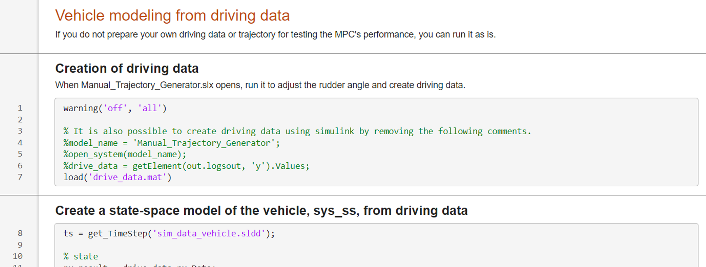

# adaptive_mpc

This repository models vehicles using vehicle driving data. It implements MPC using that model for lateral control of vehicle track following.
Comparing the track following error with MPC using a two-wheel model, it can be seen that MPC using driving data is able to follow the track with a smaller RMSE.

# How to use

1. Open `data_driven_mpc.mlx`.

2. If you do not provide your own driving data or reference trajectory for testing, execute all code.
3. Finally, a graph is displayed showing the tracking error between the MPC using the two-wheel model and the MPC using driving data.

# Required toolbox

The following toolbox is used in this model.
   -  MATLAB® 
   -  Simulink® 
   -  Control System Toolbox™ 
   -  Model Predictive Control Toolbox™ 
   -  Simulink Control Design™ 
   -  Navigation Toolbox™ 
   -  Vehicle Dynamics Blockset™ 
   -  MATLAB Coder™, Simulink Coder™, Embedded Coder® 

# License

Since this is a modified version of The MathWorks, Inc. sample code, the license is in accordance with the one created by The MathWorks, Inc. See LICENSE for details.

# Reference websites

1. [Simulation of longitudinal and lateral vehicle motion with Vehicle Dynamics Blockset](https://jp.mathworks.com/videos/simulating-longitudinal-and-lateral-vehicle-dyanamics-1664547380990.html)
2. [Design adaptive MPC in a black box](https://www.youtube.com/watch?v=XP3lHpqBG9M&list=PLPQVx3HzGQWKnCOSnOxFfR5231Hesd)

3. [MPC Implementation Example](https://jp.mathworks.com/matlabcentral/fileexchange/77879-mpc-implementation-example)

4. [About MPC implemented in Autoware](https://autowarefoundation.github.io/autoware.universe/main/control/mpc_lateral_controller/model_predictive_control_algorithm/)
